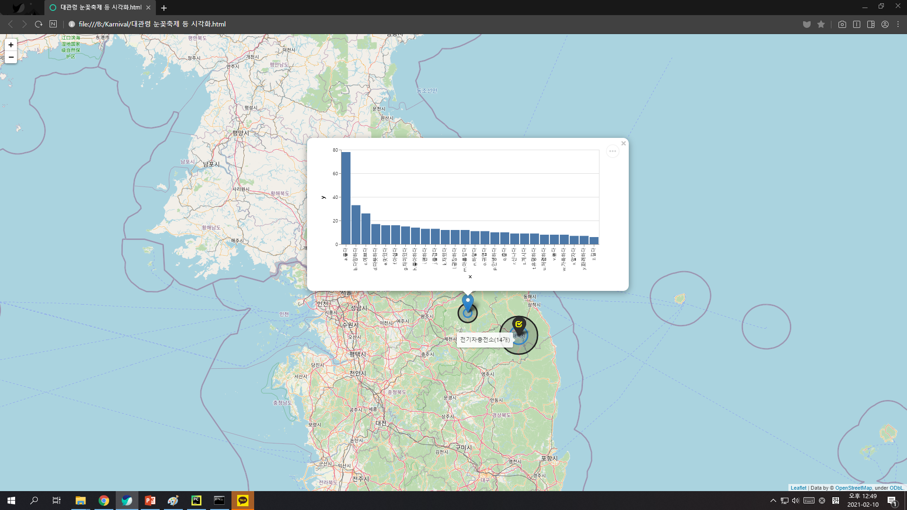

# Karnival
## Usage
### 종속성 설치
```python -m pip install -r requirements.txt```

### 축제 정보 생성

```json
{
  "name": "화천 실내얼음조각광장",
  "keywords": [
    "실내얼음조각광장 후기"
  ],
  "engines": [
    "NAVER"
  ],
  "lat": 38.14212,
  "long": 127.67615,
  "local_name": "화천군",
  "facility_keywords": {}
}
```
`축제이름.json` 파일을 생성해 위와 같은 형식의 데이터를 저장합니다.

>**중요: 공공데이터포털의 데이터에 화천군의 시설이 포함되어 있지 않아 정상적으로 작동하지 않습니다. 구글 지도에서 검색하려면 facility_keywords 키에 아래 예시와 같은 형식의 데이터를 입력합니다.**
```
"facility_keywords": {"숙박시설": ["강원도 화천군 호텔", "강원도 화천군 민박"], "음식점": ["강원도 화천군 음식점"]}
```

### 크롤러 실행
축제 데이터를 생성했다면 아래 명령을 실행합니다.
`python preprocessor.py`
> 안내: 축제 하나의 정보를 분석하는데 약 1분 이상의 시간이 소요됩니다.

아래와 같은 출력이 생성되며 작업 폴더에 축제명으로 폴더가 생성됩니다.
```
예상완료시간: 4.0분 이상
[+] Step 1. Crawling data
 - Crawling '2019 대관령 눈꽃축제 후기' on naver........................................................................
........................................................................................................................
........................................................................................................................
........................................................................................................................
..............Done.

[+] Step 2. Extract the original form of the adjectives from data
 - Extracting
........................................................................................................................
........................................................................................................................
........................................................................................................................
........................................................................................................................
..............................................................................................................Done.

[+] Step 3. Sentimental analyzer
 - Calculating...
  max 5.153846153846153
  min -43.670103092783506
  ave -1.0893391702209034
  std 4.495130334886889
Done.

[+] Step 4. Crawling map data
평창군 {'숙박시설': 589, '전기차충전소': 22, '관광안내소': 5, '금연구역': 134}
Done.

[+] Step 5. Save parameters
Done.

[+] Final. Rename directory
Done.

[+] Step 1. Crawling data
 - Crawling '2019 태백산 눈축제 후기' on naver..........................................................................
........................................................................................................................
........................................................................................................................
........................................................................................................................
...................................Done.

[+] Step 2. Extract the original form of the adjectives from data
 - Extracting
........................................................................................................................
........................................................................................................................
........................................................................................................................
...........................................................Done.

[+] Step 3. Sentimental analyzer
 - Calculating...
  max 4.608695652173913
  min -32.65369649805447
  ave -0.8678358352883206
  std 3.8123254542969867
Done.

[+] Step 4. Crawling map data
태백시 {'숙박시설': 9, '전기차충전소': 14, '관광안내소': 2, '금연구역': 253}
Done.

[+] Step 5. Save parameters
Done.

[+] Final. Rename directory
Done.
```
### 데이터 시각화
위의 작업이 완료되었다면 다음 명령을 실행합니다.
지도 위에 그려진 데이터가 웹 브라우저에서 실행됩니다.

`map_visualizer.py "축제 1,축제 2,축제 3,축제 4,..." 중심간접자본`

첫번째 인자는 표시할 축제들입니다. 따옴표로 구분됩니다.
>주의: 따옴표 사이에 공백이 없어야 합니다.

예시 명령은 다음과 같습니다.

`map_visualizer.py "대관령 눈꽃축제,태백산 눈축제" 전기차충전소`

다음과 같은 화면이 나타납니다.


원 위에 마우스 오버하면 힌트 라벨이 표시됩니다.
마커를 클릭하면 감정형용단어 빈도수가 나타납니다.
마커에 마우스 오버하면 축제명이 나타납니다.

> 해당 예시는 `result_example.html` 파일에 저장되어 있습니다.